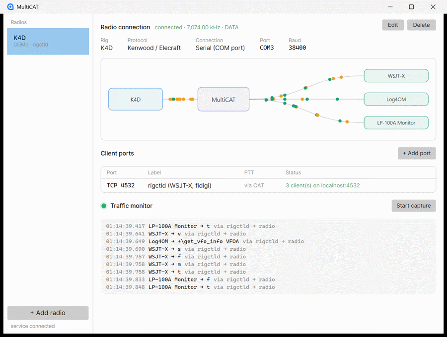

# MultiCAT

*One radio, many owners.*

At present the Genius emulation is pretty rough. we are running into problems trying to bridge COM ports to the virtualflex driver. While I am confident it will be worked out, I really want to express caution here. The 403a Genius gear has pretty robust interlock protection built in so if it doesn't like something it will generally pout and let you know but not always. So, YMMV. It works much better if you connect to your radio via network and leave the legacy COM stuff out. - AB0R



*Live: one K4 shared by a logger, a wattmeter monitor and a PowerGenius, TunerGenius
and AntennaGenius — every command attributed to the app that sent it.*

MultiCAT is a graphical CAT multiplexer for Windows: it takes exclusive ownership of a
radio's CAT port, then shares that radio with as many applications as you like — each
one convinced it has the rig to itself. Pick your rig from the hamlib database, point
WSJT-X and your logger at it over the network, and drive a 4O3A Genius stack from a
radio that isn't a FlexRadio.

## Why

Only one program can hold a COM port. The existing workarounds each solve half the
problem: generic serial-port splitters share the bytes but corrupt interleaved CAT
transactions; rigctld multiplexes properly but only for network-aware clients;
OmniRig has its own rig database and its own client API; the polished commercial
suites are single-brand and closed source. MultiCAT aims at the missing combination:

- **Real hamlib underneath** — MultiCAT supervises an actual `rigctld` per radio, so
  anything hamlib-aware connects and behaves, rather than meeting an emulation that
  works until it doesn't.
- **A 4O3A Genius stack from any radio** — MultiCAT presents your rig to a
  PowerGenius, TunerGenius and AntennaGenius as a FlexRadio, so the amplifier, tuner
  and antenna switch follow a radio that never spoke Flex.
- **The transmit VFO, not the dial** — band-following gear is told the frequency you
  are about to transmit on, which during a split QSO is the other VFO entirely.
- **A live traffic monitor** — every command attributed to the app that sent it, so
  "which program just moved my radio?" has an answer.
- **You can see what is connected** — a bubble per live client, nameable, so a station
  running five things is legible at a glance.

## Status

Early development — pre-alpha.

Working today:

- Core engine: Kenwood/Elecraft and Icom CI-V framers, transaction arbiter,
  short-TTL poll cache, client port endpoints, radio state tracker with
  frequency/mode events (unit tested)
- Serial transport for real radios (opens only the configured port, never probes)
- Network transport for TCP radios (Elecraft K4/K4D on port 9200): background
  reconnect, and `AI2` push mode so the rig reports frequency/mode the instant
  they change (validated against a fake K4 emulating the real protocol)
- Client endpoints, all driverless: a hamlib **rigctld-protocol listener** (WSJT-X,
  fldigi, JTDX, GridTracker, and anything hamlib-aware connects natively) and raw
  CAT over TCP, both on localhost. **Validated with real WSJT-X**: connected as
  "Hamlib NET rigctl" at `localhost:4532`, it polled at 1 Hz (mostly served from
  the poll cache while three other clients polled concurrently), and a band change
  QSYed the radio with every other client following
- Virtual COM port management for com0com, where its driver still loads (see below)
- Service host: radio sessions from `appsettings.json`, gRPC control API over a
  named pipe, built-in simulated K3 for driverless development
- Avalonia GUI connected live to the service: radio status, per-port state, one-click
  Add port, and a streaming traffic monitor (falls back to demo data when the
  service is offline)

- Rig picker backed by hamlib's full rig database (311 models, harvested from
  hamlib 4.7.2 at build time by `tools/HamlibHarvest` — the shipped app contains
  no native hamlib, only the knowledge)

- **4O3A Genius stack endpoint** — MultiCAT impersonates a FLEX-8600 so a
  PowerGenius, TunerGenius and AntennaGenius follow any hamlib-supported radio.
  **Verified against real hardware**: all three boxes following an Elecraft K4D
  through MultiCAT, band-follow and PTT interlock, RF passing. Discovery can be
  pinned to your boxes so the radio stays invisible to everything else on the
  network, and advertising is always a deliberate action — stopping it returns
  every box to its no-transceiver antenna, as a real radio being switched off would
- **Both VFOs, radio-style** — `VFO A · mode · ◀TX · mode · VFO B` with split
  indicated, because during a split QSO the frequency that matters to an amplifier
  is the one you are about to transmit on
- Configuration kept in `C:\ProgramData\MultiCAT\radios.json`, so downloading a new
  version does not lose your radios; the app tells you when a newer release exists,
  and never installs it itself

**OmniRig: connects, but does not track.** `MultiCat.OmniRig` registers as
`OmniRig.OmniRigX` and implements VE3NEA's interfaces GUID-for-GUID, and an
early-bound client reads it correctly. Late-bound clients — which is what real
OmniRig applications are — read the frequency once and never see another update.
The cause is a .NET limitation rather than a bug we can reach: an out-of-process
managed COM server does not deliver events to those clients, and moving the server
to .NET Framework 4.8 fixed reading without fixing tracking. **Use the
Hamlib/rigctld path instead** — Log4OM, CW Skimmer and the rest support it, and it
works properly. The server is still in the box for anyone who wants to experiment.

Not yet built: CI-V session wiring (the framer exists; sessions are
Kenwood-family for now), PTT arbitration between clients, applying a selected rig's
serial defaults to the connection form, SO2R (two virtual radios on one host),
first-party virtual COM driver.

### Virtual COM ports and the driver reality

MultiCAT manages the virtual port driver for you — you never touch `setupc.exe`
or see a CNCA0/CNCB0 name. With the signed
[com0com](https://sourceforge.net/projects/com0com/) driver installed, **Add
port** picks a free COM name (avoiding names burned in the Windows COM Name
Arbiter database), creates the pair silently (one UAC prompt), starts
arbitrating it, and persists it to configuration.

**However:** current Windows 11 builds enforce driver-signing policy that
rejects com0com's 2012-era signature outright (device problem code 52),
regardless of Memory Integrity settings. On such systems MultiCAT runs fully
driverless via the rigctld and TCP endpoints; a first-party attestation-signed
driver is the planned long-term fix for real COM ports there. On Windows 10 and
older Windows 11 builds, the com0com path works as designed.

## Building

Requires the [.NET 10 SDK](https://dotnet.microsoft.com/download/dotnet/10.0).

```
dotnet build MultiCat.sln
dotnet test MultiCat.sln
dotnet run --project src/MultiCat.Gui
```

## Layout

| Project | Purpose |
| --- | --- |
| `MultiCat.Core` | Framers, transaction arbiter, poll cache, state tracker — no I/O dependencies |
| `MultiCat.Hamlib` | Rig capability database harvested from hamlib at build time — no native dependency |
| `MultiCat.Contracts` | Shared GUI ↔ service contracts |
| `MultiCat.Service` | The multiplexer host: owns the radio ports, runs sessions |
| `MultiCat.OmniRig` | OmniRig-compatible COM server bridging OmniRig apps to the mux |
| `MultiCat.Gui` | Avalonia configuration and monitoring front end |
| `tests/MultiCat.Core.Tests` | Engine unit tests |

## Credits

The rig capability database in `MultiCat.Hamlib` is derived from the
[Hamlib project](https://hamlib.github.io) (LGPL-2.1-or-later), harvested at
build time from `rigctl --dump-caps`. MultiCAT ships no hamlib code — but the
knowledge of 300+ rigs' CAT parameters is the Hamlib community's work, and
this project would be poorer without it.

The OmniRig COM interface definitions and bundled `OmniRig.tlb` come from
[OmniRig](https://github.com/VE3NEA/OmniRig) by Alex Shovkoplyas VE3NEA (MIT
license) — the de facto rig-control API of the Windows ham ecosystem, generously
open-sourced.

## License

GPLv3 — see [LICENSE](LICENSE).
